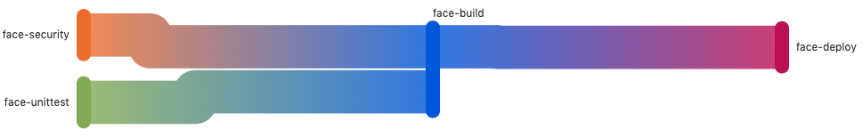

# Gitlab CI/CD Pipeline

## .gitlab-ci.yml
 * The CI/CD commands are in a file called `.gitlab-ci.yml` that must be stored in the root of the repository


## Stages
 * a pipeline runs in one or more stages
 * within each stage, there can be different jobs
 * a typical CI/CD pipeline consists of 3 stages
    * test, build, deploy
 * the stage needs to be defined in each job

```yaml
stages:
  - test
  - build
  - deploy
```

## Jobs
 * you can give the job any name
 * the main part of the job is a `script` key which indicates what the job needs to do
 * it consists of various attributes like 
    * `stage`: which stage this job belongs to
    * `needs`: this job requires a previous job to run first b4 start
    * `variables`: define variables to use in script
    * `images`: base image to run in
    * `before_script`: runs some script b4 `script` starts, usually installation 
    * `rules`: define conditions when the job will run

## dind
 * in the CI/CD environment, a docker image is built so that scripts can be run, default is ruby image
 * however, if we need to build or run docker images, we need to use a Docker in Docker (dind) service instead
 * we can specify it as latest or with a particular version
 * **IMPT** this image is built using Alpine linux, so all installations require the `apk` package

```yaml
image: docker:19.03.8
services:
  - docker:19.03.8-dind
```

## Gitlab Container Registry
 * The space limit for the whole repository, including the container registry is **10GB**, so the space might not be always sufficient
 * The in-built env variable `$CI_REGISTRY_IMAGE` defines the repo registry name and can be used directly
 * We can subdivide each image into two further levels, by project & modules, if required. E.g., There are two modules in the repository, in gitlab-ci, we can tag the image into `$CI_REGISTRY_IMAGE/module1` & `$CI_REGISTRY_IMAGE/module2`

```yaml
humandet-build:
  stage: build
  variables:
    module: humandetection
    image_tag: $CI_REGISTRY_IMAGE/humandetection:latest
  script:
    - docker build -t $image_tag ./$module
    - docker push $image_tag
  only:
    changes:
      - humandetection/**/*
```

## Rules

 * Rules are essential to indicate the conditions when jobs can run. It can be used in place of `only` & `except`, but rules should be preferred as they are more verbose and easier to understand
 * Example below indicates that the CI/CD will only run if it is a merge request, and if the target merge branch is master. Also, there needs to be a file change in the folder facedetection.

```yaml
testing:
  stage: test
  script:
    - echo testing
  rules:
    - if: '$CI_PIPELINE_SOURCE == "merge_request_event" && $CI_MERGE_REQUEST_TARGET_BRANCH_NAME == "master"' 
      changes:
        - facedetection/**/*
      when: always
```

## Environment Variables

 * Under Settings > CI/CD > Variables, you can set your environment variables that can be called within a gitlab runner
 * Only Maintainer & Owner have the rights to this option
 * The variables are **protected** by default, and if so, they can only be accessed when changes are made to a protected branch.
    1. Store your access keys, passwords etc. here
    2. If for some reason your login using the keys/pw failed, it could be because the branch or method of pipeline is not protected
    3. Note that merged requests will not enable a protected variable to be read
    4. It might be better to just **mask** the variable instead


## SSH

 * For deployment, SSH is essential to access your server to launch a deployment script
 * Steps to enable SSH
    1. in your local machine > ssh-keygen > create public & private keys
    2. cd ~/.ssh/ > ls > you should see two files, `id_rsa`, which is the private key & `id_rsa.pub`,which is the public key
    3. `cat id_rsa` > copy the entire contents (including the ----OPEN and END ---- lines), and put in gitlab settings > variables
    4. `cat id_rsa.pub` > copy the entire contents
        * SSH into your server
        * `cd ~/.ssh/`
        * `nano authorized_keys`
        * paste the private keys contents
    5. add `known_hosts` in the job
    6. follow format before in the job to 
 * **Ref**: https://docs.gitlab.com/ee/ci/ssh_keys/

```yaml
variables:
    - ip: xx.xxx.xx.x
before_script:
    - which ssh-agent || ( apt-get update -y && apt-get install openssh-client -y )
    - eval $(ssh-agent -s)
    - echo "$SSH_PRIVATE_KEY" | tr -d '\r' | ssh-add -
    - mkdir -p ~/.ssh
    - chmod 700 ~/.ssh
    - touch ~/.ssh/known_hosts
    - ssh-keyscan $ip >> ~/.ssh/known_hosts
    # - echo "$SSH_KNOWN_HOSTS" >> ~/.ssh/known_hosts
    - chmod 644 ~/.ssh/known_hosts
script:
    - ssh ubuntu@$ip echo something...
```

# AWS

 * Accessing AWS services requires AWS CLI2 (command line) & the access key, secret key, region stored as environment variables
 * gitlab has a ubuntu image for [AWS CLI2](https://docs.gitlab.com/ee/ci/cloud_deployment/#run-aws-commands-from-gitlab-cicd)

```yaml
deploy:
  stage: deploy
  image: registry.gitlab.com/gitlab-org/cloud-deploy/aws-base:latest
  script:
    - aws s3 ...
    - aws create-deployment ...
```

 * However, if we need docker, e.g. AWS ECR services, we can use the `dind` service and install AWS CLI2 on top of it
 * AWS CLI2 does not have a default alpine installation, but we can use `ci-aws_cli2-alpine.sh` file instead, source from [link](https://stackoverflow.com/questions/60298619/awscli-version-2-on-alpine-linux)

```yaml
deploy:
  stage: deploy
  image: docker:latest
  services:
    - docker:latest-dind
  before_script:
    - ci-aws_cli2-alpine.sh
  script:
    - aws ecr get-login-password --region $AWS_DEFAULT_REGION | docker login --username AWS --password-stdin $ecr_url
    - docker build -t ...
```

## Example Pipeline

DAG display in Gitlab Pipeline GUI showing the dependencies of the jobs



`.gitlab-ci.yml` file example

```yaml
stages:
  - test
  - build
  - deploy


# UNIT-TESTING -----------
face-unittest:
  stage: test
  image: docker:19.03.8
  services:
    - docker:19.03.8-dind
  variables:
    port: 5003
    module: facedetection
  before_script:
    - sh unittest/ci-test-install.sh
  script:
    - cd unittest
    - bash ci-test.sh
  rules:
    - if: '$CI_PIPELINE_SOURCE == "merge_request_event"' 
      changes:
        - facedetection/**/*
      when: always

# SECURITY SCANNING -----------
face-security:
  stage: test
  image: docker:19.03.8
  services:
    - docker:19.03.8-dind
  variables:
    module: facedetection
  before_script:
    - apk update
    - apk upgrade
    - apk add curl jq python3-dev py-pip
    - pip install bandit
  script:
    - cd unittest
    - sh ci-security.sh
  rules:
    - if: '$CI_PIPELINE_SOURCE == "merge_request_event"' 
      changes:
        - facedetection/**/*
      when: always

# BUILD -----------
face-build:
  stage: build
  needs: ["face-unittest","face-security"]
  image: docker:19.03.8
  services:
    - docker:19.03.8-dind
  variables:
    ecr_url: $aws_account_id.dkr.ecr.$AWS_DEFAULT_REGION.amazonaws.com
    module: facedetection
  before_script:
    - sh unittest/ci-aws_cli2-install.sh
  script:
    - sh unittest/ci-build.sh
  rules:
    - if: '$CI_PIPELINE_SOURCE == "merge_request_event" && $CI_MERGE_REQUEST_TARGET_BRANCH_NAME == "master"' 
      changes:
        - facedetection/**/*
      when: always

# DEPLOYMENT -----------
face-deploy: 
  stage: deploy
  needs: ["face-build"]
  variables:
    port: 5003
    ip: <ip-address>
    module: facedetection
    ecr: $aws_account_id.dkr.ecr.$AWS_DEFAULT_REGION.amazonaws.com
  before_script:
    - which ssh-agent || ( apt-get update -y && apt-get install openssh-client -y )
    - eval $(ssh-agent -s)
    - echo "$SSH_PRIVATE_KEY" | tr -d '\r' | ssh-add -
    - mkdir -p ~/.ssh
    - chmod 700 ~/.ssh
    - touch ~/.ssh/known_hosts
    - ssh-keyscan $ip >> ~/.ssh/known_hosts
    # - echo "$SSH_KNOWN_HOSTS" >> ~/.ssh/known_hosts
    - chmod 644 ~/.ssh/known_hosts
  script:
    - sh unittest/ci-deploy.sh
  rules:
    - if: '$CI_PIPELINE_SOURCE == "merge_request_event" && $CI_MERGE_REQUEST_TARGET_BRANCH_NAME == "master"' 
      changes:
        - facedetection/**/*
      when: always
```

## Useful Bash Snippets

### Check API server has started

```bash
# check flask server has started
time_elapsed=1
while true; do
    echo "waiting flask server to start... $time_elapsed sec"
    content=$(curl -s -w "%{http_code}" http://docker:$port)
    statuscode="${content:(-3)}"

    if [ $statuscode -gt 299 ]
    then echo "Flask Server Error: $statuscode"
         echo "Error Msg: $content"
         exit 1
    elif [[ $statuscode == "200" ]]
    then echo -e "Flask Server Launched\n"
         break
    fi

    if [[ $time_elapsed == '40' ]]
    then docker logs $module
         exit 1
    fi

    sleep 1
    time_elapsed=$((time_elapsed + 1))
done
```

### Check Python has Exit, so Job Fails

```bash
python3 test_api.py || exit 1
```

```python
import sys
import traceback

try:
    something
except:
    print(traceback.format_exc())
    sys.exit(1)
```

### Some Common Installations

```bash
apk update
apk upgrade
apk add --no-cache curl bash jq python3-dev
pip3 install --upgrade pip
pip3 install requests
# required for pillow
apk add --no-cache jpeg-dev zlib-dev gcc musl-dev
pip3 install pillow
```