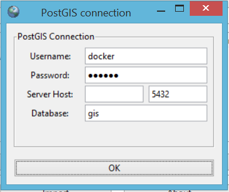
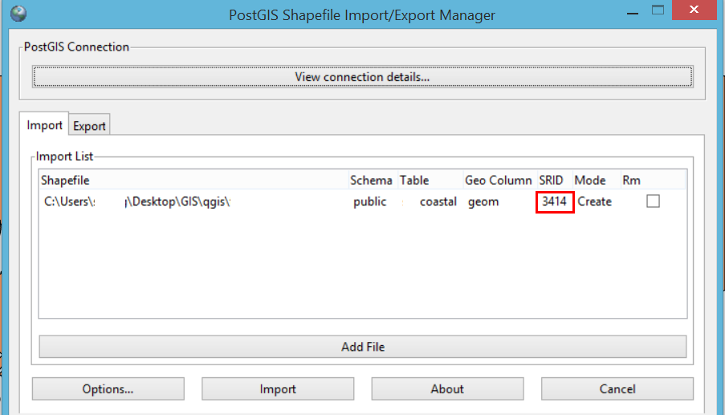

PostGIS
=========

Upload Shapefiles
------------------

Go to `C:\Program Files\PostgreSQL\9.6\bin\postgisgui` or whichever directory it was installed in.
Open the GUI and connect to the database.

    
    
